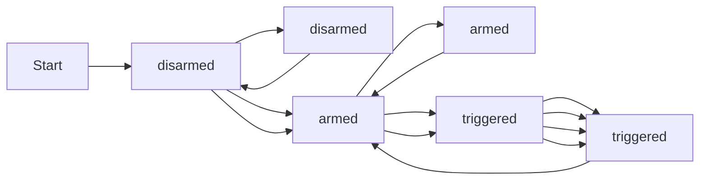

# Simple Security System

## States and Inputs
This simple FSM contains 3 states:
- armed
- disarmed
- triggered

And requires 2 inputs:
- door open (door is not locked)
- motion detected

## How it Works
The alarm is disarmed by default, therefore its initial state is 'disarmed'. Take a look at the diagram below showing how the machine works.

Below is a state and transition table derived from the diagram above.

| Current State | Input: Door Open | Input: Motion Detected | Next State |
| --- | --- | --- | --- |
| disarmed | 0 | 0 | disarmed |
| disarmed | 1 | 0 | armed |
| disarmed | 0 | 1 | armed |
| disarmed | 1 | 1 | armed |
| armed | 0 | 0 | disarmed |
| armed | 1 | 0 | armed |
| armed | 0 | 1 | triggered |
| armed | 1 | 1 | triggered |
| triggered | 0 | 0 | armed |
| triggered | 1 | 0 | triggered |
| triggered | 0 | 1 | triggered |
| triggered | 1 | 1 | triggered |

## K-Map
TBC

## Truth Table
TBC
