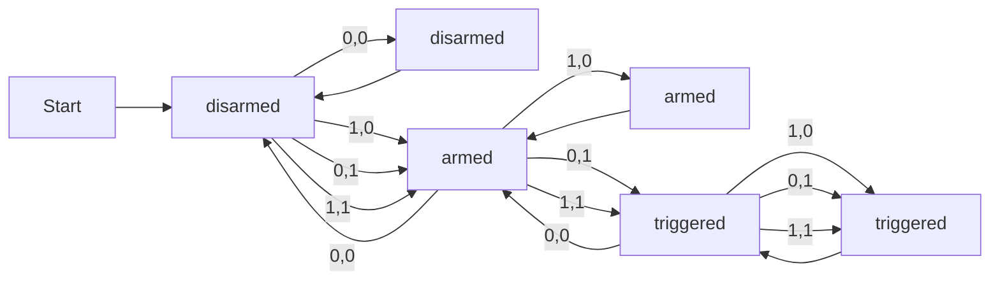

# Simple Security System

## States and Inputs
This simple FSM contains 3 states:
- armed
- disarmed
- triggered

And requires 2 inputs:
- door open
- motion detected

## How it Works
The alarm is disarmed by default, therefore its initial state is 'disarmed'. Take a look at the diagram below showing how the machine works.

**Input syntax:** 
doorOpen,motionDetected 

doorOpen = 0       --> Door is locked 
doorOpen = 1       --> Door is unlocked/open 
motionDetected = 0 --> No motion is detected 
motionDetected = 1 --> Motion is detected 

Key points to take away:
- As long as the door is locked and there is no motion detected, the system will remain disarmed. As such, inputting 0,0 repeatedly won't do anything to arm the system.
- The system arms itself if the door is open and/or motion is detected. In other words, any input other than 0,0 while the system is disarmed, will arm the system.
- The system disarms itself if the door is finally locked and no more motion is detected. Therefore, inputting 0,0 while the system is armed, will disarm the system.
- As long as the door is open after arming the system, the system will remain armed. Meaning that inputting 1,0 while the system is armed, keeps the system armed.
- If motion is detected while the system is armed, the alarm will be triggered. Hence, if the value for motionDetected is 1 while the system is armed, the alarm will trigger.
- The alarm will only stop after the door is relocked and no more motion is detected. This resets the system back from 'triggered' to 'armed'. Thus, this reset can only be initiated if 0,0 is inputted while the system is 'triggered'.

Below is the complete state and transition table derived from the diagram above.

| Current State | Input: Door Open | Input: Motion Detected | Next State |
| --- | --- | --- | --- |
| disarmed | 0 | 0 | disarmed |
| disarmed | 1 | 0 | armed |
| disarmed | 0 | 1 | armed |
| disarmed | 1 | 1 | armed |
| armed | 0 | 0 | disarmed |
| armed | 1 | 0 | armed |
| armed | 0 | 1 | triggered |
| armed | 1 | 1 | triggered |
| triggered | 0 | 0 | armed |
| triggered | 1 | 0 | triggered |
| triggered | 0 | 1 | triggered |
| triggered | 1 | 1 | triggered |

## K-Map
TBC

## Truth Table
TBC
