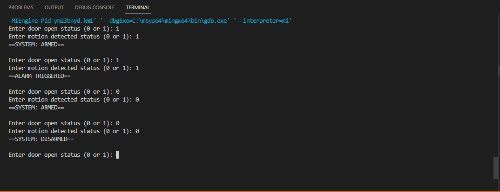

# Simple Security System

## States and Inputs
This simple FSM contains 3 states:
- armed
- disarmed
- triggered

And requires 2 inputs:
- door open
- motion detected

## How it Works
The alarm is disarmed by default, therefore its initial state is 'disarmed'. Take a look at the diagrams below showing how the machine works.

**Input syntax:** 
doorOpen,motionDetected 

doorOpen = 0       --> Door is locked 
doorOpen = 1       --> Door is unlocked/open 
motionDetected = 0 --> No motion is detected 
motionDetected = 1 --> Motion is detected 

The diagram above can be broken down into the one below:

What are the diagrams above saying?
- As long as the door is locked and there is no motion detected, the system will remain disarmed. As such, inputting 0,0 repeatedly won't do anything to arm the system.
- The system arms itself if the door is open and/or motion is detected. In other words, any input other than 0,0 while the system is disarmed, will arm the system.
- The system disarms itself if the door is finally locked and no more motion is detected. Therefore, inputting 0,0 while the system is armed, will disarm the system.
- As long as the door is open after arming the system, the system will remain armed. Meaning that inputting 1,0 while the system is armed, keeps the system armed.
- If motion is detected while the system is armed, the alarm will be triggered. Hence, if the value for motionDetected is 1 while the system is armed, the alarm will trigger.
- The alarm will only stop after the door is relocked and no more motion is detected. This resets the system back from 'triggered' to 'armed'. Thus, this reset can only be initiated if 0,0 is inputted while the system is 'triggered'.

Below is the complete state and transition table derived from the diagram above.

| Current State | Input: Door Open | Input: Motion Detected | Next State |
| --- | --- | --- | --- |
| disarmed | 0 | 0 | disarmed |
| disarmed | 1 | 0 | armed |
| disarmed | 0 | 1 | armed |
| disarmed | 1 | 1 | armed |
| armed | 0 | 0 | disarmed |
| armed | 1 | 0 | armed |
| armed | 0 | 1 | triggered |
| armed | 1 | 1 | triggered |
| triggered | 0 | 0 | armed |
| triggered | 1 | 0 | triggered |
| triggered | 0 | 1 | triggered |
| triggered | 1 | 1 | triggered |

From this table, we can derive K-maps for each state and their respective combinatorial boolean equations (I will write these equations as how they are displayed in the .c file for easier understanding):

### 'disarmed':

| \ | **00** | **01** |
| --- | --- | --- |
| **0** | *1* | 0 |
| **1** | *1* | 0 |

The equation for this table is:  
nextState = doorOpen' 

### 'armed':

| \ | **00** | **01** | **11** | **10** |
| --- | --- | --- | --- | --- |
| **0** | 0 | 0 | *1* | *1* |
| **1** | 0 | 0 | *1* | *1* |

The equation for this table is:  
nextState = doorOpen + motionDetected 

### 'triggered':

| \ | **00** | **01** |
| --- | --- | --- |
| **0** | *1* | 0 |
| **1** | *1* | 0 |

The equation for this table is the same as 'disarmed':  
nextState = doorOpen' 

## Implementation in C

### To run the code on Windows in Visual Studio Code (VSC):
1. Download the .c file in my repository and open it on VSC.
2. Set up a debugging configuration for the project by making sure the C/C++ extension and a C compiler (preferably GCC) are installed in VSC. Once it's installed, create a `launch.json` configuration file.
3. Once that's done, you may debug the file and select the configuration which has gcc.exe in it.
4. Once the code is up and running, you may use the terminal to enter your inputs and play around with the FSM.

### Output
Here is an example of the system running:

